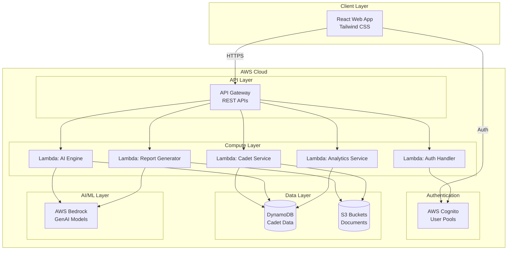

# Design Document: NCC Cadet Growth Intelligence Platform

## Overview

The NCC Cadet Growth Intelligence Platform is a serverless, AI-powered web application that centralizes cadet data across India's National Cadet Corps and provides intelligent growth recommendations. The system uses AWS cloud services for scalability, AWS Bedrock for AI-powered insights, and a React-based frontend for responsive user experiences across desktop and mobile devices.

The platform serves three primary user roles:
- **Cadets**: Access personal dashboards, view AI recommendations, and generate reports
- **Officers**: Monitor unit activities, approve registrations, and access analytics
- **Admins**: Manage system-wide configurations and user approvals

Key design principles:
- Serverless architecture for automatic scaling and cost optimization
- Role-based access control for security and data privacy
- AI-first approach for personalized cadet development
- Mobile-responsive design for accessibility
- Event-driven architecture for real-time updates

## Architecture

### High-Level Architecture



### Technology Stack

**Frontend:**
- React.js 18+ for component-based UI
- Tailwind CSS for responsive styling
- React Router for client-side routing
- Axios for API communication
- Chart.js for data visualizations

**Backend:**
- AWS Lambda (Node.js 18.x runtime) for serverless compute
- API Gateway for RESTful API endpoints
- AWS Cognito for authentication and authorization
- DynamoDB for NoSQL data storage
- S3 for document and file storage
- AWS Bedrock (Claude 3 Sonnet) for AI capabilities

**Infrastructure:**
- AWS CloudFormation or Terraform for IaC
- CloudWatch for logging and monitoring
- IAM for fine-grained access control

## Components and Interfaces

### 1. Authentication Service

**Responsibility:** Manages user authentication, registration, and role-based access control.

**Key Functions:**
- `registerCadet(userData)`: Creates pending cadet account in Cognito
- `approveRegistration(cadetId, adminId)`: Activates cadet account
- `rejectRegistration(cadetId, reason)`: Marks account as rejected
- `login(credentials)`: Authenticates user and returns JWT token
- `validateToken(token)`: Verifies JWT and extracts user role
- `refreshSession(refreshToken)`: Renews expired session

**Interfaces:**
```typescript
interface UserCredentials {
  email: string;
  password: string;
}

interface CadetRegistration {
  email: string;
  password: string;
  fullName: string;
  unitId: string;
  directorate: string;
  phoneNumber: string;
  enrollmentDate: string;
}

interface AuthResponse {
  accessToken: string;
  refreshToken: string;
  userId: string;
  role: 'CADET' | 'OFFICER' | 'ADMIN';
  expiresIn: number;
}
```

### 2. Cadet Service

**Responsibility:** Manages cadet profile data, attendance, camp participation, and rank progression.

**Key Functions:**
- `getCadetProfile(cadetId)`: Retrieves complete cadet profile
- `updateAttendance(cadetId, attendanceRecord)`: Records attendance event
- `recordCampParticipation(cadetId, campDetails)`: Logs camp completion
- `updateRank(cadetId, newRank)`: Updates cadet rank
- `getCadetsByUnit(unitId)`: Returns all cadets in a unit
- `searchCadets(query, filters)`: Searches cadet records

**Interfaces:**
```typescript
interface CadetProfile {
  cadetId: string;
  fullName: string;
  email: string;
  unitId: string;
  directorate: string;
  enrollmentDate: string;
  currentRank: string;
  attendancePercentage: number;
  completedCamps: Camp[];
  skills: SkillAssessment[];
  createdAt: string;
  updatedAt: string;
}

interface Camp {
  campId: string;
  campName: string;
  campType: 'ATC' | 'RDC' | 'TSC' | 'NIC' | 'OTHER';
  startDate: string;
  endDate: string;
  location: string;
  performanceScore?: number;
}

interface SkillAssessment {
  skillName: string;
  category: 'DRILL' | 'SHOOTING' | 'LEADERSHIP' | 'FITNESS' | 'ACADEMICS';
  score: number;
  assessedDate: string;
}

interface AttendanceRecord {
  date: string;
  status: 'PRESENT' | 'ABSENT' | 'LEAVE';
  activityType: string;
}
```

### 3. AI Growth Intelligence Engine

**Responsibility:** Analyzes cadet data and generates personalized growth recommendations using AWS Bedrock.

**Key Functions:**
- `generateRecommendations(cadetId)`: Creates personalized camp and skill recommendations
- `assessCampEligibility(cadetId, campType)`: Determines eligibility for specific camps
- `identifySkillGaps(cadetId)`: Analyzes performance data to identify improvement areas
- `predictRankProgression(cadetId)`: Estimates timeline for next rank achievement

**Interfaces:**
```typescript
interface GrowthRecommendation {
  cadetId: string;
  generatedAt: string;
  eligibleCamps: CampRecommendation[];
  skillImprovements: SkillImprovement[];
  rankProgression: RankPrediction;
}

interface CampRecommendation {
  campType: string;
  campName: string;
  isEligible: boolean;
  eligibilityScore: number;
  requirements: string[];
  nextAvailableDate?: string;
}

interface SkillImprovement {
  skillName: string;
  currentScore: number;
  targetScore: number;
  improvementPercentage: number;
  actionableSteps: string[];
  priority: 'HIGH' | 'MEDIUM' | 'LOW';
}

interface RankPrediction {
  currentRank: string;
  nextRank: string;
  estimatedTimeMonths: number;
  completionPercentage: number;
  missingRequirements: string[];
}
```

**AI Prompt Strategy:**

The AI Engine uses structured prompts to AWS Bedrock with the following pattern:

```
You are an NCC growth advisor. Analyze the following cadet profile and provide recommendations.

Cadet Profile:
- Name: {name}
- Current Rank: {rank}
- Attendance: {attendance}%
- Completed Camps: {camps}
- Skill Scores: {skills}

Task: Generate recommendations for:
1. Camp eligibility (ATC, RDC, TSC, NIC)
2. Skill improvements with specific targets
3. Rank progression timeline

Format your response as JSON matching the GrowthRecommendation interface.
```

### 4. Report Assistant

**Responsibility:** Generates structured camp reports and event reflections using GenAI.

**Key Functions:**
- `generateCampReport(campId, templateType)`: Creates formatted camp report
- `generateEventReflection(eventId, participantIds)`: Produces event summary
- `customizeReport(reportId, userEdits)`: Applies user modifications
- `finalizeReport(reportId)`: Stores completed report in S3
- `getReportHistory(cadetId)`: Retrieves past reports

**Interfaces:**
```typescript
interface ReportRequest {
  reportType: 'CAMP' | 'EVENT' | 'REFLECTION';
  eventId: string;
  participantIds: string[];
  templateType?: string;
  customInstructions?: string;
}

interface GeneratedReport {
  reportId: string;
  reportType: string;
  title: string;
  content: string;
  metadata: {
    eventName: string;
    eventDate: string;
    participants: number;
    location: string;
  };
  status: 'DRAFT' | 'FINALIZED';
  s3Url?: string;
  createdAt: string;
}
```

### 5. Unit Activity Dashboard Service

**Responsibility:** Aggregates and presents unit-level statistics for officers.

**Key Functions:**
- `getUnitStatistics(unitId, dateRange)`: Calculates aggregate metrics
- `getCadetPerformanceSummary(unitId)`: Lists individual cadet summaries
- `getAttendanceTrends(unitId, period)`: Analyzes attendance patterns
- `getCampParticipationRates(unitId)`: Calculates camp engagement metrics

**Interfaces:**
```typescript
interface UnitStatistics {
  unitId: string;
  unitName: string;
  totalCadets: number;
  averageAttendance: number;
  campParticipationRate: number;
  rankDistribution: Record<string, number>;
  topPerformers: CadetSummary[];
  needsAttention: CadetSummary[];
  dateRange: {
    startDate: string;
    endDate: string;
  };
}

interface CadetSummary {
  cadetId: string;
  fullName: string;
  rank: string;
  attendancePercentage: number;
  campsCompleted: number;
  overallScore: number;
}
```

### 6. Institutional Memory Service

**Responsibility:** Manages searchable repository of historical events and achievements.

**Key Functions:**
- `indexEvent(eventData)`: Adds new event to repository
- `searchMemory(query, filters)`: Searches historical records
- `getEventDetails(eventId)`: Retrieves complete event information
- `linkDocuments(eventId, documentUrls)`: Associates files with events
- `getUnitHistory(unitId, years)`: Returns unit's historical timeline

**Interfaces:**
```typescript
interface HistoricalEvent {
  eventId: string;
  eventType: 'CAMP' | 'CEREMONY' | 'COMPETITION' | 'TRAINING' | 'OTHER';
  title: string;
  description: string;
  date: string;
  unitId: string;
  directorate: string;
  participants: string[];
  outcomes: string[];
  documents: DocumentReference[];
  tags: string[];
  createdAt: string;
}

interface DocumentReference {
  documentId: string;
  fileName: string;
  fileType: string;
  s3Url: string;
  uploadedBy: string;
  uploadedAt: string;
}

interface SearchResult {
  events: HistoricalEvent[];
  totalResults: number;
  relevanceScores: Record<string, number>;
}
```

### 7. Analytics Service

**Responsibility:** Generates performance reports and data visualizations for decision-making.

**Key Functions:**
- `generatePerformanceReport(scope, dateRange)`: Creates analytics report
- `exportReport(reportId, format)`: Exports report as PDF or CSV
- `getDirectorateAnalytics(directorateId)`: Aggregates directorate-level data
- `getTrendAnalysis(metric, period)`: Analyzes trends over time

**Interfaces:**
```typescript
interface AnalyticsReport {
  reportId: string;
  scope: 'UNIT' | 'DIRECTORATE' | 'NATIONAL';
  scopeId: string;
  dateRange: DateRange;
  metrics: {
    totalCadets: number;
    averageAttendance: number;
    campParticipation: number;
    rankProgressions: number;
  };
  trends: TrendData[];
  visualizations: ChartData[];
  generatedAt: string;
}

interface TrendData {
  metric: string;
  dataPoints: Array<{
    date: string;
    value: number;
  }>;
  trend: 'INCREASING' | 'DECREASING' | 'STABLE';
  changePercentage: number;
}

interface ChartData {
  chartType: 'LINE' | 'BAR' | 'PIE' | 'SCATTER';
  title: string;
  data: any;
  config: any;
}
```

## Data Models

### DynamoDB Table Design

**Table 1: Cadets**
- Partition Key: `cadetId` (String)
- Attributes: fullName, email, unitId, directorate, enrollmentDate, currentRank, attendancePercentage, skills, createdAt, updatedAt
- GSI 1: unitId-enrollmentDate-index (for unit queries)
- GSI 2: directorate-currentRank-index (for directorate analytics)

**Table 2: Attendance**
- Partition Key: `cadetId` (String)
- Sort Key: `date` (String, ISO format)
- Attributes: status, activityType, recordedBy, recordedAt

**Table 3: Camps**
- Partition Key: `campId` (String)
- Attributes: campName, campType, startDate, endDate, location, unitId, directorate, participants, createdAt

**Table 4: CampParticipation**
- Partition Key: `cadetId` (String)
- Sort Key: `campId` (String)
- Attributes: performanceScore, completionDate, certificateUrl, feedback

**Table 5: Recommendations**
- Partition Key: `cadetId` (String)
- Sort Key: `generatedAt` (String, ISO timestamp)
- Attributes: eligibleCamps, skillImprovements, rankProgression, ttl (for automatic expiration)

**Table 6: Reports**
- Partition Key: `reportId` (String)
- Attributes: reportType, eventId, title, content, metadata, status, s3Url, createdBy, createdAt
- GSI 1: createdBy-createdAt-index (for user report history)

**Table 7: HistoricalEvents**
- Partition Key: `eventId` (String)
- Attributes: eventType, title, description, date, unitId, directorate, participants, outcomes, documents, tags, createdAt
- GSI 1: unitId-date-index (for unit history)
- GSI 2: directorate-date-index (for directorate history)

**Table 8: Users**
- Partition Key: `userId` (String, Cognito sub)
- Attributes: email, role, cadetId (if applicable), unitId, directorate, registrationStatus, approvedBy, approvedAt, createdAt

### S3 Bucket Structure

```
ncc-platform-documents/
├── reports/
│   ├── {reportId}/
│   │   └── report.pdf
├── certificates/
│   ├── {cadetId}/
│   │   └── {campId}.pdf
├── event-documents/
│   ├── {eventId}/
│   │   ├── photos/
│   │   └── documents/
└── profile-photos/
    └── {cadetId}/
        └── profile.jpg
```

## Correctness Properties

*A property is a characteristic or behavior that should hold true across all valid executions of a system—essentially, a formal statement about what the system should do. Properties serve as the bridge between human-readable specifications and machine-verifiable correctness guarantees.*


### Registration and Approval Properties

Property 1: Pending account creation
*For any* valid cadet registration submission, the system should create an account record with status "PENDING"
**Validates: Requirements 1.1**

Property 2: Invalid registration rejection
*For any* incomplete or invalid registration data, the system should reject the submission and return specific validation errors for each missing or invalid field
**Validates: Requirements 1.2**

Property 3: Admin review completeness
*For any* pending registration, the admin review interface should display all submitted registration fields (email, fullName, unitId, directorate, phoneNumber, enrollmentDate)
**Validates: Requirements 1.3**

Property 4: Approval state transition
*For any* pending registration, when approved by an admin, the account status should change to "ACTIVE" and a confirmation notification should be queued
**Validates: Requirements 1.4**

Property 5: Rejection state transition
*For any* pending registration, when rejected by an admin with a reason, the account status should change to "REJECTED" and a notification with the reason should be queued
**Validates: Requirements 1.5**

### Authentication and Authorization Properties

Property 6: Valid authentication success
*For any* user with valid credentials in the system, authentication should succeed and return a JWT token with correct userId and role
**Validates: Requirements 2.1**

Property 7: Invalid authentication rejection
*For any* invalid credentials (non-existent user or incorrect password), authentication should fail and return an error message
**Validates: Requirements 2.2**

Property 8: Cadet role routing
*For any* authenticated user with role "CADET", the system should route them to the cadet dashboard interface
**Validates: Requirements 2.3**

Property 9: Officer role routing
*For any* authenticated user with role "OFFICER", the system should route them to the unit activity dashboard interface
**Validates: Requirements 2.4**

Property 10: Session expiration enforcement
*For any* expired user session, API requests should be rejected with an authentication error until the user re-authenticates
**Validates: Requirements 2.5**

### Dashboard Data Display Properties

Property 11: Attendance percentage display
*For any* cadet with attendance records, the dashboard should display an attendance percentage calculated as (present days / total days) × 100
**Validates: Requirements 3.1**

Property 12: Camp data display
*For any* cadet, the dashboard should display all completed camps from their record and all camps they are currently eligible for based on AI recommendations
**Validates: Requirements 3.2**

Property 13: Rank progression display
*For any* cadet, the dashboard should display their current rank and progress percentage toward the next rank
**Validates: Requirements 3.3**

### AI Growth Intelligence Properties

Property 14: Recommendation generation completeness
*For any* cadet profile, the AI Engine should generate recommendations containing eligibleCamps, skillImprovements, and rankProgression fields
**Validates: Requirements 4.1**

Property 15: Eligible camp information
*For any* cadet-camp pair where isEligible is true, the recommendation should include the camp name and eligibility status set to true
**Validates: Requirements 4.2**

Property 16: Ineligible camp improvement guidance
*For any* cadet-camp pair where isEligible is false, the recommendation should include specific skill improvements with target scores and actionable steps
**Validates: Requirements 4.3**

### Report Generation Properties

Property 17: Report structure generation
*For any* valid report request, the Report Assistant should generate a report containing title, content, and metadata fields
**Validates: Requirements 5.1**

Property 18: Report content completeness
*For any* generated camp report, it should include event details (name, date, location), participant information, and key outcomes in the content or metadata
**Validates: Requirements 5.2**

Property 19: Report storage and linking
*For any* finalized report, it should be stored in S3 with a valid URL and linked to the appropriate cadet or unit record in DynamoDB
**Validates: Requirements 5.4**

### Unit Dashboard Properties

Property 20: Unit attendance aggregation
*For any* unit with cadet attendance records, the unit dashboard should display average attendance calculated as the mean of all cadets' attendance percentages
**Validates: Requirements 6.1**

Property 21: Camp participation rate calculation
*For any* unit, the camp participation rate should be calculated as (cadets who completed at least one camp / total cadets) × 100
**Validates: Requirements 6.2**

Property 22: Cadet summary completeness
*For any* unit, the dashboard should display performance summaries for all cadets in that unit, each containing cadetId, fullName, rank, attendancePercentage, and campsCompleted
**Validates: Requirements 6.3**

Property 23: Date range filtering accuracy
*For any* date range filter applied to unit statistics, all displayed metrics should only include data from records within that date range
**Validates: Requirements 6.4**

### Institutional Memory Properties

Property 24: Search result relevance
*For any* search query, all returned events should contain the query terms in their title, description, or tags fields
**Validates: Requirements 7.1**

Property 25: Historical event display completeness
*For any* historical event, the detail view should display eventType, title, description, date, participants, outcomes, and associated documents
**Validates: Requirements 7.2**

Property 26: Automatic event indexing
*For any* completed event, it should be automatically added to the Institutional Memory repository within the same transaction
**Validates: Requirements 7.3**

Property 27: Organizational filter accuracy
*For any* unit or directorate filter, search results should only include events where the unitId or directorate matches the filter value
**Validates: Requirements 7.4**

Property 28: Search result ranking
*For any* search results, they should be ordered first by relevance score (descending) and then by date (most recent first) for equal relevance scores
**Validates: Requirements 7.5**

### Data Storage and Access Properties

Property 29: Document storage round-trip
*For any* uploaded document, storing it in S3 and then retrieving it by the returned URL should yield the same file content
**Validates: Requirements 8.2**

Property 30: Cross-interface data consistency
*For any* data item (cadet profile, camp record, etc.), retrieving it through different API endpoints should return identical values for all shared fields
**Validates: Requirements 8.3**

Property 31: Role-based access enforcement
*For any* data access request, if the requesting user's role does not have permission for that resource, the request should be rejected with a 403 Forbidden error
**Validates: Requirements 8.4**

Property 32: Error retry with backoff
*For any* failed data operation (DynamoDB or S3), the system should retry with exponentially increasing delays (e.g., 1s, 2s, 4s) up to a maximum number of attempts
**Validates: Requirements 8.5**

### Session Management Properties

Property 33: Session state preservation
*For any* navigation action within the application, the user's session state (authentication token, user context, current filters) should remain unchanged
**Validates: Requirements 9.5**

### Notification Properties

Property 34: Registration approval notification
*For any* approved cadet registration, a notification should be created with type "REGISTRATION_APPROVED" and sent to the cadet's email
**Validates: Requirements 10.1**

Property 35: Recommendation notification
*For any* newly generated AI recommendation, a notification should be created and sent to the cadet informing them of new growth insights
**Validates: Requirements 10.2**

Property 36: Camp eligibility notification
*For any* cadet whose eligibility status changes from ineligible to eligible for a camp, a notification should be sent with the camp details
**Validates: Requirements 10.3**

Property 37: Unit announcement broadcast
*For any* unit announcement published by an officer, all cadets with unitId matching the announcement's unitId should receive a notification
**Validates: Requirements 10.4**

Property 38: Notification history persistence
*For any* sent notification, it should be stored with delivery status and be retrievable through the user's notification history endpoint
**Validates: Requirements 10.5**

### Analytics and Reporting Properties

Property 39: Analytics visualization generation
*For any* analytics report request, the generated report should include visualizations (charts) for key metrics: attendance trends, camp participation, and rank distribution
**Validates: Requirements 11.1**

Property 40: Analytics content completeness
*For any* generated analytics report, it should include attendance trends, camp participation rates, and rank progression statistics in the metrics or trends fields
**Validates: Requirements 11.2**

Property 41: Directorate-level aggregation
*For any* directorate analytics request, the report should include aggregated data from all units where the unit's directorate field matches the requested directorate
**Validates: Requirements 11.3**

Property 42: Report export format availability
*For any* analytics report, the export function should successfully generate both PDF and CSV format outputs with the same underlying data
**Validates: Requirements 11.4**

Property 43: Analytics filtering accuracy
*For any* combination of filters (date range, unit, cadet cohort), the analytics should only include data matching all applied filter criteria
**Validates: Requirements 11.5**

## Error Handling

### Error Categories and Strategies

**1. Authentication Errors**
- Invalid credentials: Return 401 with clear error message
- Expired session: Return 401 with "SESSION_EXPIRED" code
- Insufficient permissions: Return 403 with required role information
- Strategy: Use AWS Cognito error codes and map to user-friendly messages

**2. Validation Errors**
- Missing required fields: Return 400 with list of missing fields
- Invalid data format: Return 400 with field-specific validation messages
- Business rule violations: Return 422 with explanation
- Strategy: Validate at API Gateway level and in Lambda functions

**3. AI Service Errors**
- Bedrock timeout: Retry up to 3 times with exponential backoff
- Bedrock rate limit: Queue request and retry after delay
- Invalid AI response: Log error, return cached recommendations if available
- Strategy: Implement circuit breaker pattern for AI calls

**4. Data Storage Errors**
- DynamoDB throttling: Implement exponential backoff retry (1s, 2s, 4s, 8s)
- Item not found: Return 404 with resource identifier
- Conditional check failure: Return 409 conflict error
- S3 upload failure: Retry up to 3 times, then return 500
- Strategy: Use AWS SDK built-in retry logic with custom backoff

**5. System Errors**
- Lambda timeout: Set appropriate timeout limits (30s for AI, 10s for data operations)
- Memory exhaustion: Monitor CloudWatch metrics, increase Lambda memory if needed
- Unexpected exceptions: Log full stack trace, return 500 with generic message
- Strategy: Comprehensive logging and monitoring with CloudWatch

### Error Response Format

All API errors follow this structure:

```json
{
  "error": {
    "code": "ERROR_CODE",
    "message": "Human-readable error message",
    "details": {
      "field": "Additional context"
    },
    "timestamp": "2024-01-15T10:30:00Z",
    "requestId": "uuid"
  }
}
```

### Graceful Degradation

- If AI Engine is unavailable, display cached recommendations with staleness indicator
- If S3 is unavailable for document retrieval, show document metadata without download link
- If analytics service fails, display raw data tables instead of visualizations
- If notification service fails, queue notifications for retry and show in-app message

## Testing Strategy

### Dual Testing Approach

The NCC Cadet Growth Intelligence Platform requires both unit testing and property-based testing for comprehensive coverage:

**Unit Tests** focus on:
- Specific examples of valid and invalid inputs
- Edge cases (empty data, boundary values, special characters)
- Integration points between components (API Gateway → Lambda, Lambda → DynamoDB)
- Error conditions and exception handling
- AWS service mocking and integration testing

**Property-Based Tests** focus on:
- Universal properties that hold for all inputs (see Correctness Properties section)
- Comprehensive input coverage through randomization
- Invariants that must be maintained across operations
- Round-trip properties (store → retrieve, serialize → deserialize)

Both approaches are complementary and necessary. Unit tests catch concrete bugs in specific scenarios, while property tests verify general correctness across a wide input space.

### Property-Based Testing Configuration

**Framework Selection:**
- **JavaScript/TypeScript**: Use `fast-check` library for property-based testing
- Minimum 100 iterations per property test (due to randomization)
- Each property test must reference its design document property using a comment tag

**Tag Format:**
```javascript
// Feature: ncc-cadet-growth-platform, Property 1: Pending account creation
test('pending account creation property', () => {
  fc.assert(
    fc.property(fc.cadetRegistration(), (registration) => {
      const account = createAccount(registration);
      expect(account.status).toBe('PENDING');
    }),
    { numRuns: 100 }
  );
});
```

### Test Coverage Requirements

**Unit Test Coverage:**
- Authentication flows: valid login, invalid login, session management
- Data validation: registration validation, input sanitization
- Role-based routing: cadet vs officer dashboard access
- Error handling: all error categories from Error Handling section
- AWS service integration: DynamoDB operations, S3 uploads, Cognito auth

**Property Test Coverage:**
- Each of the 43 correctness properties must be implemented as a separate property-based test
- Properties should be tested close to their implementation (catch errors early)
- Each property test must explicitly reference its property number and requirement

**Integration Test Coverage:**
- End-to-end user flows: registration → approval → login → dashboard
- AI Engine integration: Bedrock API calls and response parsing
- Report generation: full report creation and S3 storage flow
- Notification delivery: trigger → queue → send → record

### Test Data Generation

**For Property-Based Tests:**
- Use `fast-check` arbitraries to generate random valid inputs
- Create custom arbitraries for domain objects (CadetProfile, Camp, etc.)
- Generate edge cases automatically (empty strings, null values, boundary numbers)

**For Unit Tests:**
- Use fixture files for consistent test data
- Mock AWS services using `aws-sdk-mock` or similar
- Create test data factories for common objects

### Continuous Testing

- Run unit tests on every commit (pre-commit hook)
- Run property tests in CI/CD pipeline before deployment
- Monitor test execution time and optimize slow tests
- Maintain test coverage above 80% for critical paths

### Testing Anti-Patterns to Avoid

- Don't write too many unit tests for scenarios covered by property tests
- Don't test implementation details (test behavior, not internal structure)
- Don't mock everything (use real AWS SDK for integration tests in test environment)
- Don't skip property tests due to execution time (they catch critical bugs)
